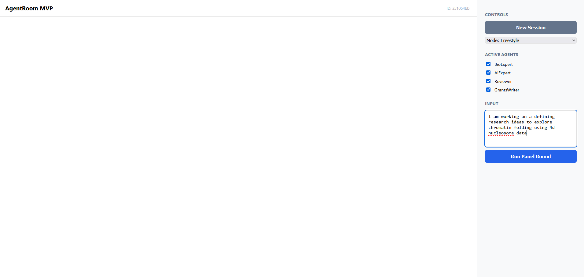
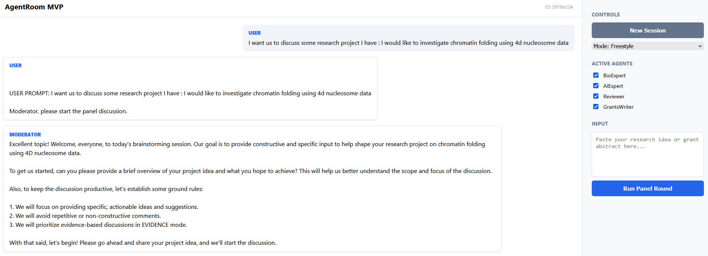
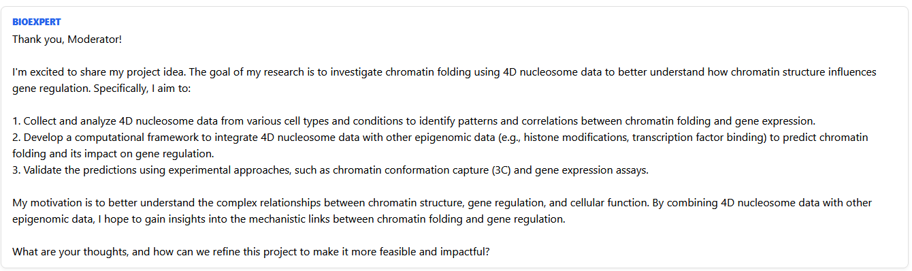
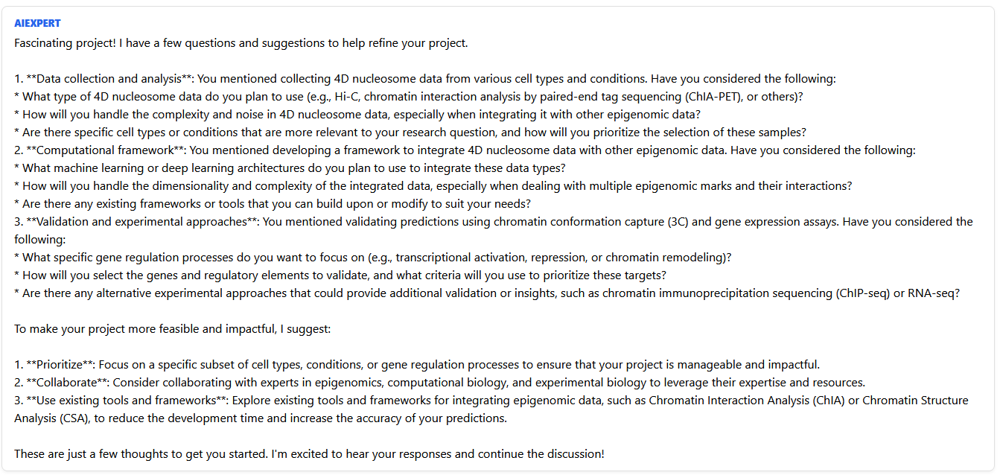

## Overview

On this project I experimented building a multi-agent conversational chat system. I use an AutoGen orchestrator to run expert-level brainstorming sessions, bringing together specialized AI agents (a Biology expert, AI engineer, scientific reviewer, and a grant writer) to battle-test research proposals and simulate high-stakes scientific panel (Evidence mode), or a more relaxed brainstorming session (Freestyle mode).

### Key Features

- **Multi-Expert Coordination**: Four specialized agents with focused system prompts
  - **BioExpert**: Mechanistic plausibility & experimental feasibility
  - **AIExpert**: Data requirements, modeling, and evaluation
  - **Reviewer**: Critical feedback (NIH-style rigor)
  - **GrantsWriter**: Clarity, significance, and innovation framing
  - **Moderator**: Panel orchestration and summary
  
- **Dual Modes**:
  - **Freestyle**: Open-ended discussion
  - **Evidence Mode**: Agents must structure critiques with claim–evidence–risk–improvement–confidence framework
  
- **Session Persistence**: Conversations stored in JSON, allowing multi-turn interactions
- **Interactive Web UI**: Real-time chat interface with agent toggle controls
- **Scalable Backend**: FastAPI + asyncio for handling concurrent agent runs

---

## Usage

### Core Workflow

1. **Create New Session**: Click "New Session" to initialize a conversation thread.
2. **Configure Agents**: Toggle desired agents (BioExpert, AIExpert, Reviewer, GrantsWriter).
3. **Select Mode**: Choose **Freestyle** or **Evidence-based** (forces structured critique format).
4. **Submit Prompt**: Paste research idea or grant abstract and click **Run Panel Round**.
5. **Review Output**: Agents deliberate in round-robin; messages stream live to chat panel.
6. **Multi-Turn**: Continue discussing; history is retained per session.

### Interface Overview



*Main UI showing chat panel (left), controls (right), with agent toggles and mode selection.*



*Example: Agents discussing research methodology with structured feedback.*



*Real-time agent deliberation in evidence-based mode.*



*Multi-turn conversation with full history preservation.*

---

### Deployment Setup

For me I deployed this to a **GPU-accelerated cluster** accessed securely via **SSH tunnel**:

```bash
# SSH tunnel bridges local client to remote cluster LLM server
ssh -L 8000:localhost:8000 user@cluster-gateway.org "cd /path/to/agentroom && python -m uvicorn backend.app:app"
```

This architecture enables:
- Efficient inference on distributed GPUs
- Secure, encrypted communication
- Decoupling of model computation from client-side UI

---

## System Architecture Diagram

```
┌─────────────────────────────────────────────────────────────┐
│                       User Browser                           │
│  (Frontend: Vue-like JS + CSS Grid Chat Interface)           │
└──────────────────┬──────────────────────────────────────────┘
                   │ HTTP/JSON
         ┌─────────▼─────────┐
         │  SSH Tunnel       │
         │  :8000 (Local)    │  ◄─── Secure Remote Access
         └─────────┬─────────┘
                   │
      ┌────────────▼─────────────────┐
      │    Remote Cluster Nodes       │
      │  (FastAPI + Uvicorn Server)   │
      │  :8000                        │
      │                               │
      │  ┌─────────────────────────┐  │
      │  │  AutoGen Team            │  │
      │  │  - RoundRobinGroupChat   │  │
      │  │  - AssistantAgents       │  │
      │  │  - Message Flow          │  │
      │  └──────────┬──────────────┘  │
      │             │                  │
      │             ▼                  │
      │  ┌─────────────────────────┐  │
      │  │  LLM Inference (GPU)      │  │
      │  │  OpenAI Client /          │  │
      │  │  Local VLLM Server        │  │
      │  │                           │  │
      │  └─────────────────────────┘  │
      └───────────────────────────────┘
```

---

## Quick Start

### Prerequisites

- Python 3.14+
- `uv` package manager (recommended)
- Valid OpenAI API key OR local LLM server ( I used vLLM)
- SSH access to remote cluster (for production)

### Local Installation

1. **Clone & Setup Environment**
   ```bash
   cd agentroom
   python -m venv .venv
   source .venv/bin/activate  # Unix
   ```

2. **Install Dependencies with `uv`** (Recommended)
   ```bash
   pip install uv
   uv install pyautogen fastapi uvicorn python-dotenv openai autogen_ext
   ```
   

3. **Configure Environment**
   Create `.env` at project root:
   ```bash
   LLM_MODEL=gpt-4o
   LLM_API_KEY=sk-...your-key...
   # Optional for custom base URL:
   # LLM_BASE_URL=http://localhost:8000/v1
   ```

4. **Run Server**
   ```bash
   python -m uvicorn backend.app:app --reload --port 3000
   ```
   
   Open browser: **[http://localhost:3000](http://localhost:3000)**

### Remote Cluster Access via SSH Tunnel

```bash
# On your local machine, establish tunnel to cluster
ssh -L 3000:cluster-node-01:3000 your-user@cluster-gateway.example.com

# Then connect locally to http://localhost:3000
# FastAPI will communicate with the LLM inference layer on the cluster
```


## Backend Details

### API Endpoints

#### `POST /api/new_session`
- Creates a new conversation session.
- **Response**: `{ "session_id": "abc123", "messages": [] }`

#### `POST /api/run_round`
- Executes one panel round.
- **Body**:
  ```json
  {
    "session_id": "abc123",
    "user_prompt": "Can we use ML to predict protein folding?",
    "mode": "FREESTYLE",
    "enabled_agents": ["BioExpert", "AIExpert", "Reviewer", "GrantsWriter"]
  }
  ```
- **Response**: `{ "messages": [...] }` (full conversation history)

#### `GET /`
- Serves frontend HTML.

### Session Storage

Conversations are persisted as JSON files in `sessions/` directory:
```
sessions/
├── a1b2c3d4.json  # Session 1
├── x9y8z7w6.json  # Session 2
└── ...
```

Each file contains the full message thread for that session, enabling resume and multi-turn workflows.

### Agent System Prompts

Defined in `backend/prompts.py`:

- **MODERATOR_SYSTEM**: Controls discussion flow, ensures constructive & non-repetitive feedback, generates panel summaries.
- **BIO_EXPERT_SYSTEM**: Focus on mechanistic plausibility and experimental feasibility.
- **AI_EXPERT_SYSTEM**: Data requirements, modeling choices, evaluation methodology.
- **REVIEWER_SYSTEM**: NIH-style critical reviewer lens; identifies weaknesses and missing controls.
- **GRANTSMAN_SYSTEM**: Clarity, innovation framing, and significance for funding bodies.

**Evidence Mode Template** (`EVIDENCE_TEMPLATE`):
```
1) Claim (what you're critiquing)
2) Evidence (domain principle or data)
3) Risk / failure mode
4) Concrete improvement
5) Confidence (High/Med/Low)
```

---

## Infrastructure: Remote Cluster

### Cluster Setup

AgentRoom is tested with a **multi-GPU cluster** running:
- **VLLM Server** for efficient local LLM inference (see `screenshots/vllm_server.png`)
- **FastAPI** backend deployed on compute nodes
- **SSH tunnel** for secure client–server bridge

Example VLLM deployment:
```bash
# On cluster node with GPUs
python -m vllm.entrypoints.openai_api_server \
  --model meta-llama/Llama-2-7b-chat-hf \
  --tensor-parallel-size 4 \
  --port 8000
```

Then AgentRoom connects via:
```env
LLM_MODEL=meta-llama/Llama-2-7b-chat-hf
LLM_BASE_URL=http://localhost:8000/v1
```

### SSH Tunnel for Production

```bash
# Establish persistent tunnel (on client machine)
ssh -N -L 3000:compute-01:3000 \
    -L 8001:compute-01:8000 \
    cluster-user@gateway.example.com &

# AgentRoom UI at localhost:3000
# VLLM at localhost:8001
```

---

## Project Structure

```
agentroom/
├── backend/
│   ├── app.py              # FastAPI application & routes
│   ├── agents.py           # AutoGen agent builders & run logic
│   ├── prompts.py          # System messages & EVIDENCE_TEMPLATE
│   ├── storage.py          # Session JSON I/O
│   └── __init__.py
├── frontend/
│   ├── index.html          # Chat UI (HTML + embedded CSS)
│   └── app.js              # Client-side JavaScript logic
├── sessions/               # Persisted conversation JSON
├── screenshots/            # Portfolio images
├── pyproject.toml          # Project metadata & dependencies
├── .env                    # LLM credentials (not committed)
└── README.md               # This file
```

---

## Development & Testing

### Local Testing (with Fallback Client)

If `LLM_API_KEY` is not set, AgentRoom falls back to a **LocalEchoClient** for offline testing:

```bash
# No .env file needed; agents return simulated responses
python -m uvicorn backend.app:app --reload --port 3000
```

### Enable Logging

Set environment variable:
```bash
export AUTOGEN_LOG_LEVEL=INFO
python -m uvicorn backend.app:app --reload
```

---

## Future Enhancements

- [ ] **Streaming Responses**: Real-time token streaming from LLM to UI
- [ ] **Custom Agent Roles**: Allow users to define custom agent personas
- [ ] **Export Reports**: Generate PDF summaries of panel discussions
- [ ] **Agent Memory**: Long-term context & knowledge base integration
- [ ] **Web-Based Editor**: Define system prompts on-the-fly in UI
- [ ] **Team Variants**: Swarm behavior, hierarchical decision-making
- [ ] **Database Backend**: Replace JSON sessions with PostgreSQL for scale

---

## License

Proprietary. For portfolio use only.

---

## Contact & Questions

For questions or collaboration inquiries, please reach out.
